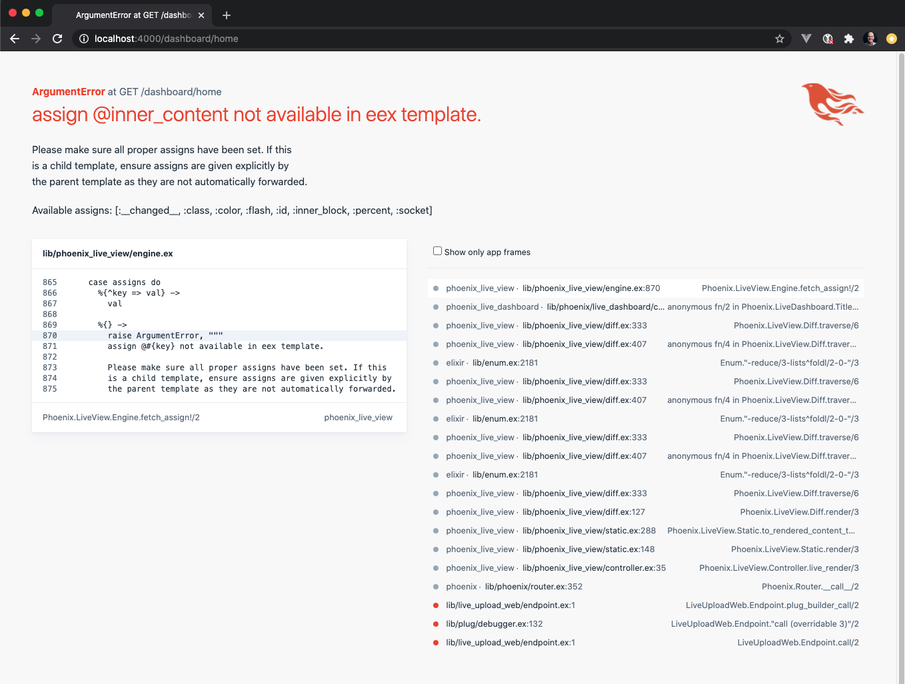

# Steps:

1. Run the following:

   ```shell
   $ mix phx.new --version

   Phoenix v1.5.6

   $ mix phx.new live_upload --live

   Fetch and install dependencies: Y

   $ cd live_upload

   $ mix ecto.create

   $ mix phx.server
   ```

1. Open a browser to `localhost:4000`
1. Click on "Live Dashboard"

   Dashboard appears to work fine

1. In mix.exs change dependency to:

   ```
   {:phoenix_live_view, github: "phoenixframework/phoenix_live_view"},
   ```

1. Get dependencies:

   ```
   $ mix deps.get

   Dependencies have diverged:
   * phoenix_live_view (https://github.com/phoenixframework/phoenix_live_view.git)
   the dependency phoenix_live_view in mix.exs is overriding a child dependency:

   > In mix.exs:
      {:phoenix_live_view, [env: :prod, git: "https://github.com/phoenixframework/phoenix_live_view.git"]}

   > In deps/phoenix_live_dashboard/mix.exs:
      {:phoenix_live_view, "~> 0.14.3", [env: :prod, hex: "phoenix_live_view", repo: "hexpm", optional: false]}

   Ensure they match or specify one of the above in your deps and set "override: true"
   ** (Mix) Can't continue due to errors on dependencies
   ```

1. Set override to true:

   ```shell
   {:phoenix_live_view, github: "phoenixframework/phoenix_live_view", override: true},
   ```

1. Get dependencies again:

   ```shell
   $ mix deps.get
   ```

1. Get the latest javascript:

   ```shell
   $ npm install --force phoenix_live_view --prefix assets
   ```

1. Start the server again

   ```shell
   $ mix phx.server
   ```

   1. Open browser to localhost:4000
   1. Click on "Live Dashboard"
   1. error (I assume this is because dashboard has not been changed to work with latest liveview)

   

1. Git init and commit

1. Create context, schema and live forms

   ```shell
   $ mix phx.gen.live Blog Post posts title body
   ```

1. Add routes to `lib/live_upload_web/router.ex`

   ```
   live "/posts", PostLive.Index, :index
   live "/posts/new", PostLive.Index, :new
   live "/posts/:id/edit", PostLive.Index, :edit

   live "/posts/:id", PostLive.Show, :show
   live "/posts/:id/show/edit", PostLive.Show, :edit
   ```

1. Migrate and start server

   ```shell
   $ mix ecto.migrate
   $ mix phx.server
   ```

   Added, edited and deleted some posts - appears to work fine

1. Commit

# Upload a File

How hard could it be?

Goal is to add a new file upload to a new blog post (not concerned about edit for now). I followed the steps in `github.com/phoenixframework/phoenix_live_view/guides/server/uploads.md` as well as I could given my understanding.

> Note: It would be ideal if uploads.md document made changes to a live form that had been created using `phx.gen.live`, including the modal, since this could be the starting point for many people. I'm happy to make these changes once I understand it myself.

> Note: It's not clear what `@upload` is. I don't think one would guess that the call to allow_upload would create an assign named `upload`. I though it was the entity that the avatar would be associated with (such as my `@post`)

## Allow uploads

1. From the guide: "You enable an upload, typically on mount, via
   [`allow_upload/3`](`Phoenix.LiveView.allow_upload/3`):

   ```elixir
   @impl Phoenix.LiveView
   def mount(_params, _session, socket) do
   {:ok,
      socket
      |> assign(:uploaded_files, [])
      |> allow_upload(:avatar, accept: ~w(.jpg .jpeg), max_entries: 2)}
   end
   ```

   It's not clear whether these should go in the `mount` in `post_live/index.ex` or in the `apply_action(socket, :new, _params)` function which is called when the 'New Post' button is clicked (or route to /posts/new). I picked the `apply_action` function, as I would think `allow_upload` would need to be called each time the model form is opened...

   `lib/live_upload_web/live/post_live/index.ex`

   ```elixir
   defp apply_action(socket, :new, _params) do
      socket
      |> assign(:page_title, "New Post")
      |> assign(:post, %Post{})
      # added the next 2 lines
      |> assign(:uploaded_files, [])
      |> allow_upload(:avatar, accept: ~w(.jpg .jpeg .png), max_entries: 1)
   end
   ```

## Render Reactive Element

1. Add the element to the form:

   `lib/live_upload_web/live/post_live/form.component.html.leex`

   ```elixir
   ...
   <%= label f, :body %>
   <%= text_input f, :body %>
   <%= error_tag f, :body %>

   <%= live_file_input @uploads.avatar %>

   <%= submit "Save", phx_disable_with: "Saving..." %>
   ```

1. Change index.html.leex to pass @uploaded_files and @uploads to the modal:

   `lib/live_upload_web/live/post_live/index.html.leex`

   ```elixir
   <%= live_modal @socket, LiveUploadWeb.PostLive.FormComponent,
      id: @post.id || :new,
      title: @page_title,
      action: @live_action,
      post: @post,
      uploaded_files: @uploaded_files,
      uploads: @uploads,
      return_to: Routes.post_index_path(@socket, :index)
      %>
   ```

## Consume Uploaded Entries

1. Again, quoting from the guide:

   When the end-user submits a form containing a
   [`live_file_input/2`](`Phoenix.LiveView.Helpers.live_file_input/2`),
   the JavaScript client first uploads the file(s) before
   invoking the callback for the form's `phx-submit` event.

   Within the callback for the `phx-submit` event, you invoke
   the `Phoenix.LiveView.consume_uploaded_entries/3` function
   to process the completed uploads, persisting the relevant
   upload data alongside the form data:

   ```elixir
   def handle_event("save", _params, socket) do
      uploaded_files =
         consume_uploaded_entries(socket, :avatar, fn %{path: path}, _entry ->
            dest = Path.join("priv/static/uploads", Path.basename(path))
            File.cp!(path, dest)
            Routes.static_path(socket, "/uploads/#{Path.basename(dest)}")
         end)
      {:noreply, update(socket, :uploaded_files, &(&1 ++ uploaded_files))}
   end
   ```

   Because handle_event forwards the call to save_post, it was not clear where the best place to put this would be.

   Code before my changes:

   `lib/live_upload_web/live/post_live/form_component.ex`

   ```elixir
   def handle_event("save", %{"post" => post_params}, socket) do
      save_post(socket, socket.assigns.action, post_params)
   end
   ```

   ```elixir
   defp save_post(socket, :new, post_params) do
      case Blog.create_post(post_params) do
      {:ok, _post} ->
         {:noreply,
         socket
         |> put_flash(:info, "Post created successfully")
         |> push_redirect(to: socket.assigns.return_to)}

      {:error, %Ecto.Changeset{} = changeset} ->
         {:noreply, assign(socket, changeset: changeset)}
      end
   end

   ```

   I chose to put it in handle_event and add the assign to the session before passing it to save_post:

   After changes:
   `lib/live_upload_web/live/post_live/form_component.ex`

   ```elixir
   def handle_event("save", %{"post" => post_params}, socket) do
      uploaded_files =
         consume_uploaded_entries(socket, :avatar, fn %{path: path}, _entry ->
            dest = Path.join("priv/static/uploads", Path.basename(path))
            File.cp!(path, dest)
            Routes.static_path(socket, "/uploads/#{Path.basename(dest)}")
         end)

      save_post(
         update(socket, :uploaded_files, &(&1 ++ uploaded_files)),
         socket.assigns.action,
         post_params
      )
   end
   ```

1. create `priv\static\uploads` directory

1. Run the server

   ```script
      $ mix phx.server
   ```

   1. go to localhost:4000/posts
   2. Click "New Post"
   3. Fill in fields and select a file
   4. Click "save"
   5. handle_event runs but not the function called by `consume_uploaded_entries`

1. add `liveSocket.enableDebug()` to app.js

   `assets\js\app.js`

   ```javascript
   let liveSocket = new LiveSocket("/live", Socket, {
     params: { _csrf_token: csrfToken },
   });
   liveSocket.enableDebug();
   ```

1. Run the server again

   ```shell
      $ mix phx.server
   ```

   1. go to localhost:4000/posts
   2. open console
      c. Click "New Post"
   3. Fill in fields and select a file
   4. Click "save"
   5. Log shows the following: (I added comments at the end of 3 lines)

   ```
   phx-FkX8FtWVWqjnUggB mount:  -  {0: "", 1: "", 2: {…}, s: Array(4), t: "Listing Posts"}
   phoenix_live_view.js?2c90:1 phx-FkX8FtWVWqjnUggB update:  -  {2: {…}, c: {…}, t: "New Post"}
   phoenix_live_view.js?2c90:1 phx-FkX8FtWVWqjnUggB update:  -  {c: {…}}   # after tabbing from title
   phoenix_live_view.js?2c90:1 phx-FkX8FtWVWqjnUggB update:  -  {c: {…}}   # after tabbing from body
   phoenix_live_view.js?2c90:1 phx-FkX8FtWVWqjnUggB update:  -  {c: {…}}   # after selecting a file
   phoenix_live_view.js?2c90:1 phx-FkX8FtWVWqjnUggB destroyed: the child has been removed from the parent -  undefined
   phoenix_live_view.js?2c90:1 phx-FkX8GhD894iTLAFF mount:  -  {0: "Post created successfully", 1: "", 2: {…}, s: Array(4), t: "Listing Posts"}
   ```

   1. Again, there were no uploaded files and it appears `consume_uploaded_entries` never called the function in argument 4.

# Old content

To start your Phoenix server:

- Install dependencies with `mix deps.get`
- Create and migrate your database with `mix ecto.setup`
- Install Node.js dependencies with `npm install` inside the `assets` directory
- Start Phoenix endpoint with `mix phx.server`

Now you can visit [`localhost:4000`](http://localhost:4000) from your browser.

Ready to run in production? Please [check our deployment guides](https://hexdocs.pm/phoenix/deployment.html).

## Learn more

- Official website: https://www.phoenixframework.org/
- Guides: https://hexdocs.pm/phoenix/overview.html
- Docs: https://hexdocs.pm/phoenix
- Forum: https://elixirforum.com/c/phoenix-forum
- Source: https://github.com/phoenixframework/phoenix
